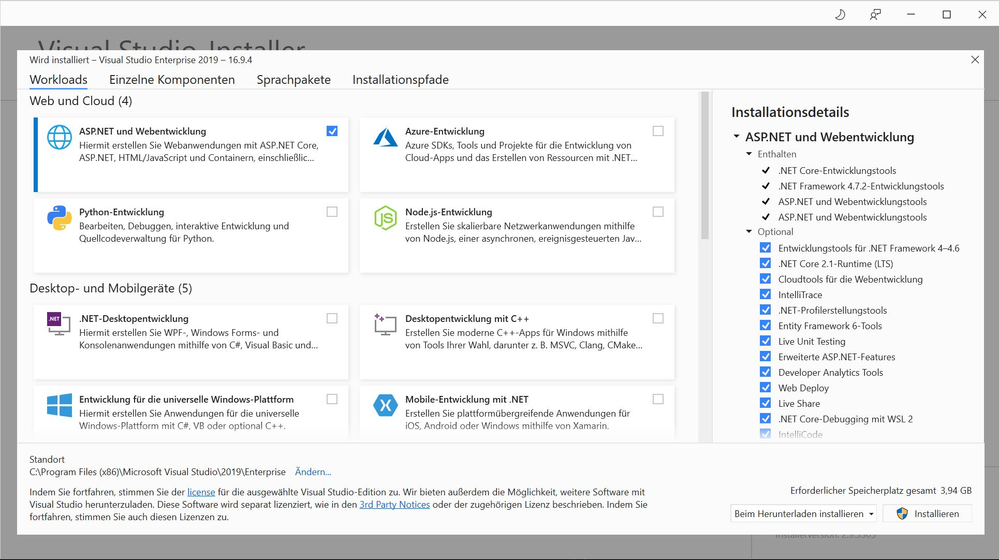
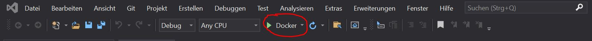

# Entwicklungsumgebung - Backend

**ACHTUNG:** Bevor das Backend gestartet werden kann, müssen ggf. Einstellungen für das Backend vorgenommen werden, sowie die Stammdaten hinterlegt werden, da diese nicht im Repository abgelegt wurden. Infos dazu befinden sich [hier](./app-settings.md).

## Installation der Entwicklungsumgebung
Für die Nutzung der Entwicklungsumgebung muss [Visual Studio 2019](https://visualstudio.microsoft.com/de/downloads/) installiert werden.
Hier empfiehlt sich die Community Edition, da diese kostenlos zur Verfügung gestellt wird.
Es ist weiterhin zu beachten, dass bei der Installation das Packet `ASP.NET und Webentwicklung` mitinstalliert werden muss.



## Öffnen der Anwendung

Um die Anwendung in der Entwicklungsumgebung zu starten, muss die Datei __WTBeiboot_SS21_Albus.sln__ geöffnet werden.
Anschließend wird die IDE mit allen entsprechenden Dateien gestartet.

## Ausführen der Anwendung in Docker inklusive Debugging

Visual Studio ermöglicht eine Verbindung zu Docker. Hierfür muss Docker auf dem Computer installiert sein.
Anschließend kann diese Möglichkeit über die Schaltfläche Docker gestartet werden.



Der Browser öffnet sich anschließend automatisch und zeigt die kompilierte Anwendung.

Es wird automatisch der Browser mit der entsprechenden URL und dem entsprechenden Port geöffnet.
Es ist weiterhin möglich die Anwendung zu debuggen.

## Ausführen der Anwendung in Docker ohne Debugging

### Backend starten

Das Backend wird per Docker (docker-compose) im Hauptverzeichnis ausgeliefert.
Mit dem Befehl 
```
docker-compose up -d backend
```
wird der Dienst `backend` gestartet. Existiert das `image` nicht auf dem Rechner, wird es heruntergeladen und automatisch beim ersten Lauf gebaut. Sollten danach Änderungen an dem Dockerfile für das Backend vorgenommen werden, muss dieser per
```
docker-compose up --build -d backend
```
neu gebaut werden. Die Option `-d` lässt bei Erfolg den Container im Hintergrund laufen. Ein erfolgreicher Start kann einmal per
```
docker-compose ps
```
überprüft bzw. der Aufruf im Browser über die URL [localhost:8080](http://localhost:8080) überprüft werden.

Mit 
```
docker-compose down
```
lässt sich der Dienst herunterfahren.

## APIs
Die API-Dokumentation ist jeweils unter `[localhost:8080/swagger/index.html](http://localhost:8080/swagger/index.html])` zu finden.
Dort können diese ebenfalls getestet werden und die URL der entsprechenden Abfrage werden ebenfalls angezeigt.